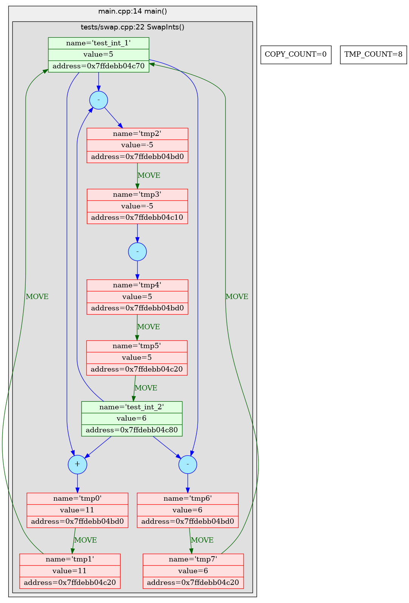
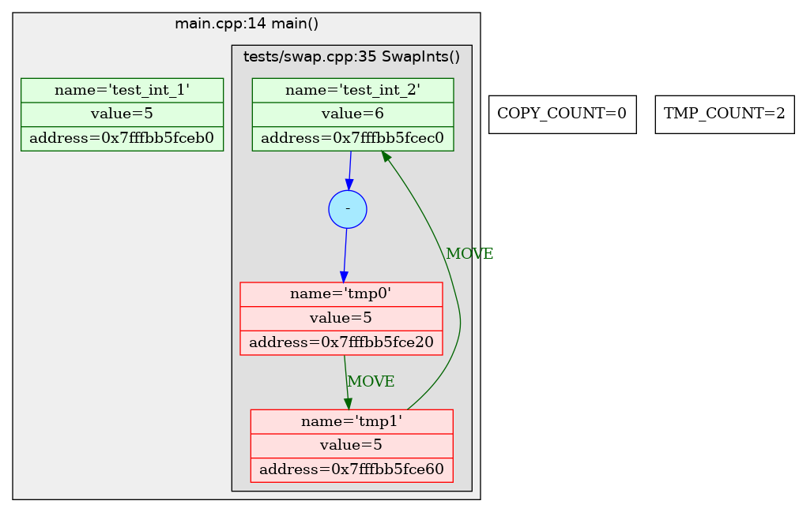

# Move/Copy Semantics

## Copy Semantics
When talking about copy semantics, it is better to differentiate
between shallow copy and deep copy.

### Shallow Copy
In shallow copy, an object is created by simply copying the data of all variables
of the original object. This works well if none of the variables of the object are
defined in the heap section of memory. If some variables are dynamically allocated
memory from heap section, then the copied object variable will also reference the
same memory location. This will create ambiguity and run-time errors, dangling pointer.
Since both objects will reference to the same memory location, then change made by
one will reflect those change in another object as well. Since we wanted to create
a replica of the object, this purpose will not be filled by Shallow copy. 

### Deep Copy
In Deep copy, an object is created by copying data of all variables, and it also
allocates similar memory resources with the same value to the object. In order to
perform Deep copy, we need to explicitly define the copy constructor and assign
dynamic memory as well, if required. Also, it is required to dynamically allocate
~memory to the variables in the other constructors, as well.

## Move Semantics
C++ move constructors use so-called rvalue references. Rvalue references
are basically references to the objects which are soon to be destroyed.
These temporary objects are never to be used by the user, thus they
can serve us as a trash can where we store all the useless data.
In move constructors we can always use shallow copying. That is why
move constructors are usually a better choice when talking about speed.

## Note
I am not going to take T(T&) and T(const T&&) into account as they
both don't make sense. The first one is dangerous because it can quite
easily modify the source if it was not originally const and it takes
precedence over the regular copy constructor. The second one is simply
stupid. The dying object says: "I'm dying, take my pointers, I don't need
them anymore". And the constructor answers: "No, I can’t do that, they are
yours and will remain with you, I can only make a copy".

## Example
Let's now consider a simple algorithm of swapping two integers (DemoInts actually).

### First Approach

As we can see here, with move constructors disabled we get a rather
unpleasing picture. Copy counter as well as the number of tmp
variables surpsass 11. Pretty expensive as for 4 lines of code, isn't it?

### Allow Move Constructors
But now take a look at what we get when we allow move semantics.

What we see now is a dramatic drop in amount of copies (more than twice as good!).
Although, the amount of tmps stays on the same level.

### Pass Arguments By Reference
We now can improve the algorithm by passing the argument by
reference rather than by value.

What we get now is 0 copies and only 7 temporary variables. But
there's always a roow for improvement! Let's now use direct assignment
operations instead of arithmetics.

### Assignment Operators

Great job! At the end we geet zero copies and a couple of temporary objects.

## Conclusion
To summarize, the copy constructor makes a deep copy, because the source
must remain untouched. The move constructor, on the other hand, can just copy
the pointer and then set the pointer in the source to null. It is okay to "nullify"
the source object in this manner, because the client has no way of inspecting the object again.
